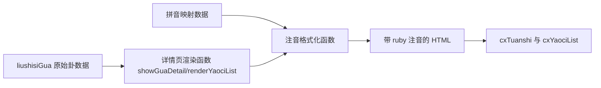

## User Requirements

- 在“六十四卦查询”中，用户选定上下卦进入卦象详情页后，为“卦辞”和“爻辞”中的汉字添加上方拼音注释。
- 拼音标注只针对详情页展示内容生效，不改变当前六十四卦选择流程、变爻点击逻辑、互卦/综卦/错卦/变卦跳转逻辑。
- 展示时需保留原有正文内容、标点和层次结构，保证可读性，不影响爻辞列表点击选中变爻。

## Product Overview

- 在卦象详情页中，把原本纯文本显示的卦辞、爻辞升级为带注音的阅读视图。
- 视觉上为汉字上方显示较小字号拼音，下方仍是原字，整体保持当前简洁卡片式布局，仅增强阅读辅助效果。

## Core Features

- 卦辞内容支持上方拼音注释显示
- 爻辞标题与正文支持上方拼音注释显示
- 标点、分隔符和非注音内容保持原样展示
- 详情页现有点击变爻与跳转能力保持不变

## Tech Stack Selection

- 当前项目为纯前端静态页面，已确认由 `index.html`、`app.js`、`yizhou-data.js` 组成
- 继续沿用原生 HTML/CSS/JavaScript 实现，不引入新框架
- 数据仍以 `yizhou-data.js` 中 `liushisiGua` 为主，新增独立拼音数据或映射工具以降低对原始卦数据的侵入

## Implementation Approach

- 采用“注音渲染函数 + 独立拼音映射数据”的方式：保持原始卦辞/爻辞文本不变，在详情页渲染阶段把文本转换为带 `<ruby><rt>` 结构的 HTML。
- 该方案只改动详情页的输出方式，把 `textContent`/字符串模板替换为安全、可控的 HTML 片段生成，最大限度复用现有数据结构与交互逻辑。
- 关键决策：
- 不直接改写 `liushisiGua` 每条数据结构，避免为 64 卦全部正文嵌入富文本，降低维护成本与回归风险。
- 使用独立拼音表，按“字级映射”或“词级优先、字级兜底”生成注音，更适合当前静态项目。
- 仅在 `showGuaDetail()` 与 `renderYaociList()` 接入，控制影响范围，避免误伤练习模块。
- 性能与可靠性：
- 单次详情页渲染处理的文本量较小，时间复杂度可控制在 O(n)，n 为当前卦辞/爻辞字符数。
- 可通过预编译映射表、复用格式化函数减少重复处理。
- 对无拼音映射的字符安全回退为原字符显示，保证不因字库不完整而阻塞页面。

## Implementation Notes

- 复用现有详情页容器：`cxTuanshi`、`cxYaociList`，仅替换其渲染内容，不改动现有模块切换流程。
- 爻辞列表仍保持 `.yaoci-item` 点击区域与 `data-yao-num` 结构，避免影响 `toggleYaociChange()`。
- 对 `yaoci.split('：')` 的标题/正文拆分逻辑保持兼容，但注音渲染应在拆分后分别处理。
- HTML 渲染需转义普通文本，避免直接拼接未处理字符串导致结构破坏。
- 样式只做注音排版增强，避免大幅调整 `.yaoci-item`、详情卡片和移动端布局。

## Architecture Design

- 数据层：`yizhou-data.js` 提供原始卦辞、爻辞；新增拼音字典文件或在现有数据文件旁扩展独立常量。
- 逻辑层：`app.js` 新增文本转注音 HTML 的工具函数，并在详情页渲染时调用。
- 展示层：`index.html` 新增 `ruby/rt` 相关样式，优化多行换行、字距与拼音字号。

系统关系如下：



## Directory Structure

## Directory Structure Summary

本次改动聚焦六十四卦详情页注音展示，只涉及现有静态前端文件与一个新增拼音数据文件，保持最小改动面。

```text
d:/project/zhouYiMaster/
├── app.js                # [MODIFY] 六十四卦详情页渲染逻辑。新增注音格式化/HTML 转换函数；在 showGuaDetail 与 renderYaociList 中改为输出带拼音的内容；确保变爻点击结构不受影响。
├── index.html            # [MODIFY] 注音展示样式。为 ruby/rt 或自定义注音类补充排版、字号、行高、换行规则，并与现有详情页样式协调。
├── yizhou-data.js        # [MODIFY/可选] 仅在需要复用现有加载顺序时补充拼音数据入口；若不适合承载，可保持原始卦数据不变。
└── pinyin-data.js        # [NEW] 拼音映射数据文件。存放生僻字或常见词的拼音表，供 app.js 渲染详情页时使用，避免污染原始卦数据结构。
```

## Key Code Structures

- 建议抽象以下关键结构（以实际实现为准）：
- 注音映射常量：用于维护汉字或词组到拼音的对应关系
- `formatTextWithPinyin(text)`：将普通文本转成带注音 HTML
- `renderPinyinText(container, text)`：向指定容器输出注音内容

## Agent Extensions

### SubAgent

- **code-explorer**
- Purpose: 在执行前进一步核对详情页相关调用链、脚本加载顺序与可能受影响的渲染点
- Expected outcome: 输出准确的修改范围与依赖关系，避免遗漏六十四卦详情页相关入口